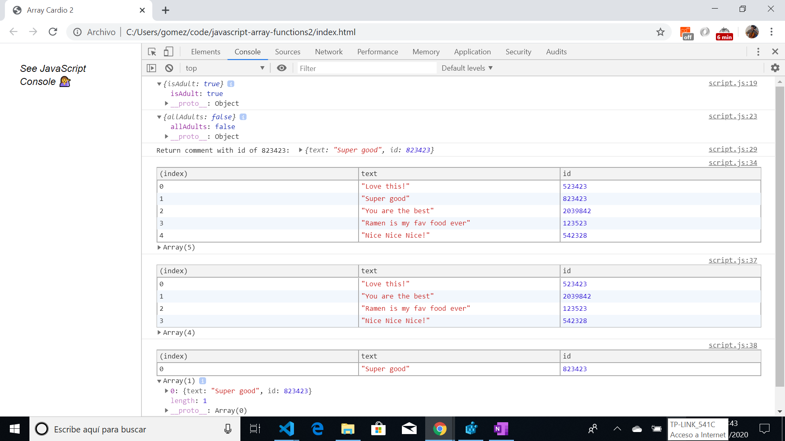

# :zap: Javascript Array Practise 2/2

Wes Bos Youtube Tutorial: [.some(), .every(), .find() and [...SPREADS] — Array Cardio Day 2 - #JavaScript30 7/30](https://www.youtube.com/watch?v=QNmRfyNg1lw&list=PLu8EoSxDXHP6CGK4YVJhL_VWetA865GOH&index=7).

*** Note: to open web links in a new window use: _ctrl+click on link_**

## :page_facing_up: Table of contents

* [General info](#general-info)
* [Screenshots](#screenshots)
* [Technologies](#technologies)
* [Setup](#setup)
* [Features](#features)
* [Status](#status)
* [Inspiration](#inspiration)
* [Contact](#contact)

## :books: General info

* Tutorial Code using more javascript array methods.

## :camera: Screenshots

.


## :signal_strength: Technologies

* Ran in Google Chrome browser with: [Javascript engine V8 for Windows (x64)](https://v8.dev/).

## :floppy_disk: Setup

* Open index.html in browser. If any code is changed the browser needs to be refreshed. Some code is commented out as it is meant to be used with a particular web link.

## :computer: Code Examples

* Example of .every array method to return true of false for 'all adults 19 or over'.

```javascript
// Array.prototype.every() // is everyone 19 or older?
const allAdults = people.every((person) => currentYear - person.year >= 19);
console.log({allAdults});
```

## :cool: Features

*  array methods .some, every, find..

## :clipboard: Status & To-Do List

* Status: Working.
* To-Do: Nothing.

## :clap: Inspiration

* Wes Bos Youtube Tutorial: [.some(), .every(), .find() and [...SPREADS] — Array Cardio Day 2 - #JavaScript30 7/30](https://www.youtube.com/watch?v=QNmRfyNg1lw&list=PLu8EoSxDXHP6CGK4YVJhL_VWetA865GOH&index=7).

## :envelope: Contact

* Repo created by [ABateman](https://www.andrewbateman.org) - you are welcome to [send me a message](https://andrewbateman.org/contact)
